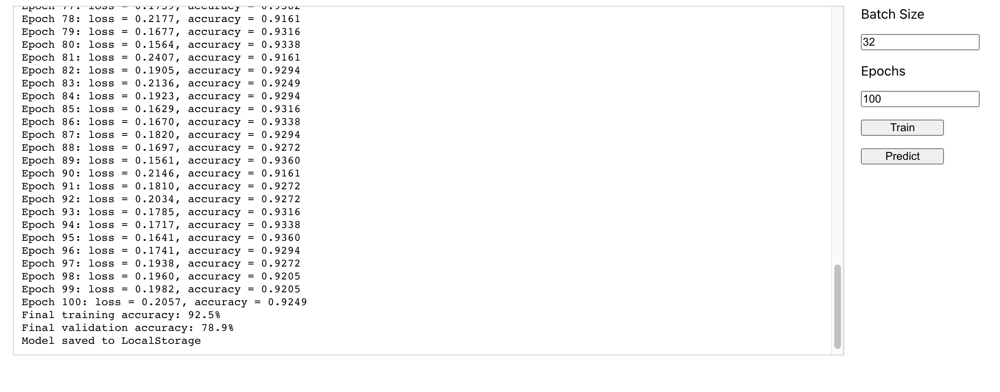

## Simple Detection of Breast Cancer

This repository contains the code and resources for the blog [post](https://around25.com/blog/creating-simple-detection-of-breast-cancer-using-react-js-and-tensorflow-js/) titled **Creating Simple Detection of Breast Cancer using React.js and TensorFlow.js** published on the [Around25](https://around25.com) company's [blog](https://around25.com/blog).

**2023 Update**: Codebase has been refactored, incorporating the latest React features, integrating new version of Tensorflow.js and I've made the following improvements:
- Increased model complexity: The model now has three dense layers with 64, 64, and 32 units, respectively. This allows the model to capture more complex patterns in the data.
- Changed the optimizer: The model now uses the Adam optimizer instead of rmsprop. Adam is known to perform well in many scenarios and can help improve convergence speed.
- Changed the loss function: The model now uses "binaryCrossentropy" as the loss function, which is more suitable for binary classification problems.
- Added validation split: During training, a portion of the training data is used for validation. This helps monitor the model's performance on unseen data and detect overfitting.
- Added early stopping: The training process now includes early stopping with a patience of 10 epochs. This helps prevent overfitting by stopping the training if the validation loss does not improve for a certain number of epochs.


## Introduction
In this blog post, we explore the process of creating a simple breast cancer detection system using React.js and TensorFlow.js. We discuss the importance of early detection and how machine learning techniques can be leveraged to assist in the diagnosis.

The blog post walks through the steps involved in building the application, including the setup of the development environment, data preprocessing, model training, and integrating the trained model into a React.js application.

## Dataset
The dataset required for this project is included in the src/dataset/datasetJson.js file of this repository. You can find the dataset in JSON format in the following location:
 - [src/dataset/datasetJson.js](/src/dataset/datasetJson.js)

The dataset source is from the UCI Machine Learning Repository. You can access the original dataset in the following link [Breast Cancer Wisconsin (Diagnostic) Data Set](https://archive.ics.uci.edu/ml/datasets/Breast+Cancer+Wisconsin+%28Diagnostic%29).
The dataset contains the necessary information for training and evaluating the breast cancer detection model.

## Features
The blog post covers the following features:
- Data Preprocessing: Explains the process of loading and preprocessing the breast cancer dataset for model training.
- Model Training: Describes the steps involved in training a TensorFlow.js model using the preprocessed dataset.
- Model Evaluation: Discusses the evaluation of the trained model using validation techniques.
React.js Integration: Guides you on integrating the trained model into a React.js application for real-time breast cancer detection.
- User Interaction: Demonstrates how to interact with the application and interpret the detection results.

## Prerequisites
Before proceeding with the installation, ensure you have the following prerequisites:
- Node.js (version 12 or higher)
- npm (Node package manager, usually comes with Node.js installation)

## Usage
1. Install node modules and start the development server 
```bash 
    npm install && npm run start
```
1. Open your web browser and visit http://localhost:3000 to access the application.
2. Follow the instructions provided in the blog post to interact with the breast cancer detection system.

## Contributing
Contributions to this project are welcome and encouraged. If you would like to contribute, please follow these steps:
1. Fork the repository on GitHub.
2. Create a new branch with a descriptive name:
```bash 
    git checkout -b my-new-feature
```
3. Make your changes and commit them with a clear message:
```bash 
    git commit -m "Add my new feature" 
```
4. Push your changes to your forked repository:
```bash
    git push origin my-new-feature
```
5. Submit a pull request describing your changes.

## License

The code and content in this repository are licensed under the [MIT License](LICENSE). Please review the license file for more information.

Feel free to reach out me anytime at [alex.donea92@gmail.com](alex.donea92@gmail.com) if you have any questions or concerns.
   